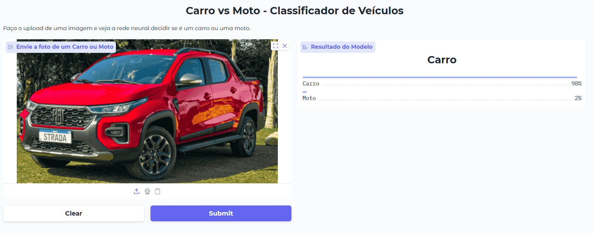
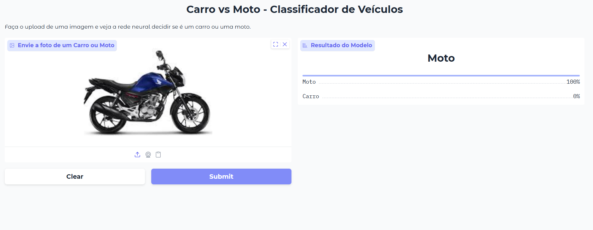

# Classificador de Veículos com Deep Learning, Gradio e Docker

## Visão Geral

Aplicação de Visão Computacional com Tensorflow/Keras capaz de classificar imagens de veículos entre as categorias **Carro** e **Moto** utilizando **Redes Neurais Convolucionais (CNNs)**, com inferência através de uma **interface Gradio** e **containerizada com Docker**.

## Demonstração

### Exemplo 1 - Classificação de Carro

A imagem abaixo foi corretamente classificada como **Carro**, com aproximadamente 98% de confiança.



---

### Exemplo 2 - Classificação de Moto

A imagem abaixo foi corretamente classificada como **Moto**, com aproximadamente 100% de confiança.



---

O projeto foi desenvolvido com foco em todo o ciclo de vida de uma aplicação de Machine Learning, incluindo:

* Coleta e preparação dos dados;
* Treinamento e avaliação do modelo;
* Construção de interface para inferência;
* Containerização da aplicação com Docker;
* Versionamento utilizando Git e GitHub.

---

## Tecnologias Utilizadas

### Machine Learning e Visão Computacional

* Python
* TensorFlow / Keras
* Redes Neurais Convolucionais (CNN)

### Interface de Inferência

* Gradio

### Containerização

* Docker

### Versionamento

* Git
* GitHub
  
### Ambiente de Treinamento

* Google Colab

---

## Dataset

Foi utilizado um dataset público de classificação de veículos disponibilizado na plataforma Kaggle, contendo imagens de carros e motos para treinamento e validação do modelo.

---

## Pipeline do Projeto

1. Download do dataset.
2. Análise exploratória das imagens.
3. Pré-processamento e redimensionamento.
4. Aplicação de Data Augmentation.
5. Treinamento da CNN utilizando TensorFlow/Keras.
6. Avaliação do modelo em conjunto de validação.
7. Exportação do modelo treinado.
8. Desenvolvimento de interface interativa com Gradio.
9. Containerização da aplicação utilizando Docker.

---

## Arquitetura da Solução

A aplicação é composta por três camadas principais:

### Modelo de Deep Learning

Responsável pela classificação das imagens utilizando uma Rede Neural Convolucional treinada para distinguir carros e motos.

### Interface de Inferência

Desenvolvida com Gradio para permitir o upload de imagens e visualização das probabilidades previstas pelo modelo.

### Container Docker

Responsável por garantir portabilidade e reprodutibilidade da aplicação em diferentes ambientes.

---

## Como Executar

### Clonar o Repositório

```bash
git clone https://github.com/EnzoFSouza/Classificador-Carro-Moto.git
cd Classificador-Carro-Moto
```

### Construir a Imagem Docker

```bash
docker build -t Classificador-Carro-Moto .
```

### Executar o Container

```bash
docker run -p 7860:7860 Classificador-Carro-Moto
```

### Acessar a Aplicação

```text
http://localhost:7860
```

---

## Estrutura do Projeto

```text
.
├── assets/
│   ├── classificacao_carro.png
│   └── classificacao_moto.png
├── notebooks/
│   └── TreinarModeloCarroMoto.ipynb
├── main.py
├── modelo_carro_moto.keras
├── requirements.txt
├── Dockerfile
└── README.md
```

---

## Competências Demonstradas

Este projeto demonstra conhecimentos práticos em:

* Desenvolvimento de modelos de Deep Learning;
* Processamento de imagens;
* Avaliação de modelos de Machine Learning;
* Desenvolvimento de interfaces para IA;
* Containerização com Docker;
* Controle de versão com Git e GitHub;
* Estruturação de projetos de Machine Learning para implantação.

---

## Próximos Passos

* Disponibilização em ambiente de produção.
* Integração com APIs REST.
* Expansão para múltiplas categorias de veículos.
* Monitoramento e avaliação contínua do modelo.
